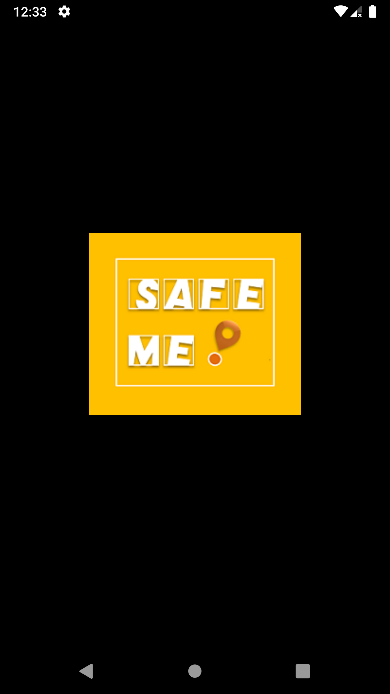
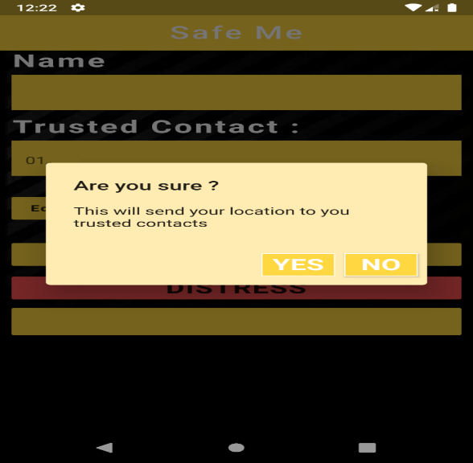

Application Design: 
I started safe me from learning the language and getting to know the android studio. I followed many tutorials and documentation. I have used the FLUTTER platform of Android Studio to develop our application. Flutter is a new creation of GOOGLE incorporation. Flutter is gaining popularity very quickly because of its high efficiency and innovative features. I have used the DART programming language for the code parts. First, I started with designing the user interface, inserting the data field, text field, and adding buttons and background. then I coded to take input from the user for name and number information. I have developed an app that is compatible with the Android operating system and Apple I operating system. I have built our framework in such a so that it runs smoothly in all the available operating system versions and also in the upcoming versions. Then I added a map module and coded the instruction to retrieve the user location in the background. Retrieving the location without the internet was very challenging for us. I had to try several different approaches to get the actual location of the device. After retrieving the location, I started working to convert the location into a map link that can be accessed from anywhere. Then I started building the SMS module. Sending the SMS in the background was a very tough job. I had requested multiple systems access to send the SMS with the link in the background. It took a lot of time to complete the SMS module. when the SMS module was ready, I tested our first beta version and it was a success but exporting the apk file was very tough. then I started on the local database to store the phone numbers. creating a database locally was a big challenge for the lack of tutorials. For two columns in the trusted contact page, I have used the “Data column”. Listing all those numbers and showing them on the page was a very big challenge for us. I attempted several documentation and tutorials, nothing was helping. At one point I had to post a question on several Q/A platforms such as Quora [2] and Stack overflow [3]. Finally, after much hardship, I were successful in that. After that, I created the map window. I created a google GCP project and generated a map API. Also added the map tab with proper location information. The map also has animated to user location services for smooth user experience. The map uses cache memory to show the offline map. Then I have created an online database to store the location data. I implemented an API to connect the online database to our app. I use firebase as an online database. I also created an offline stream to hold the data when there is no internet and upload the data when the internet is connected. The database holds the data as geopoint co-ordinates. I have also used the online database Firebase which is also a service of GOOGLE INCORPORATION. Then I exported the apk again for device testing. I are not fetching any user information or confidential data. I store the location data only. I have created a dynamic data stream to store the locations and automatically upload the location in the online secured database when any internet is connected. These location data will be used for future research and feature addition. After that, I added a loading splash screen instead of the white blank screen. I have also changed the default Flutter logo with our own Safe me logo.
I have maintained a very organized and structured approach designing every module in order to make future updates easy.
          
Logo and Loading Screen : 
The name of the application is SAFE ME mainly designed for women to seek help at the time of danger. SafeMe ensures safety to its users and always ready to help women at the time of any sort of distress or danger. I have tried to make the user interface very user friendly and fine looking. I also have set our logo as the loading screen instead of the dull white default-loading screen. Our app Icon also build with this same unique logo. 

Internal design: 
As soon as the application is opened, it shows the following options as showed in the figure.  The internal design consists of the name, trusted contacts section, map help and distress button. The name of the user using the app has to be filled in the name section. The trusted contacts are to be filled in the trusted contact section. A person can save up to three trusted contacts. And all saved information can also be changed as per need. The help map gives a good idea about the location of the user without any internet connection. All the safety apps invented before did not provide the provision to know about the location without internet. But this help map helps to know about nearby places as well as the current location.

Trusted contacts storage: 
In the trusted contact section there is scope to fill in, edit and delete contact information. The system is not only specific to save contacts at the time of installation but can be changed and deleted whenever necessary. These contacts number are saved in the app and works as soon as the distress button is pressed and the emergency contact numbers gets the distressed message. Here there is scope to save any sort of numbers that will be able to provide any help, be it any helpline or emergency hot line.  
Firebase: 
In order to store the data of the user and the emergency contacts I have used the firebase 	real-time database. This cloud saves data from the 	users. This database is actually a NoSql database. 	Firebase allows the action to perform quickly. 

Firebase

									

 

Cloud Firestore: 
This model 		supports the database. This is 	how the online database looks like to the app administrator. The markers 	collection holds all the location as geo-point. Moreover, the database  updates in realtime. 

								Cloud firestore

Cloud Firestore: 
As I can see in figure 10, this is how the database stores the location. They save the geo-point of the user ( person in emergency ). The geo-point takes the longitude and latitude of the location and stores it.		
			

				                                     Geopoint longitude and latitude

 
 Experiment Results:

The first step was storage of the contacts. The emergency contacts were successfully stored to continue the further steps. The emergency contact is the building block of this app. Because the message and the location is to be sent to the contacts saved in the app.

In the next step as soon as the ‘Distress’ button is pressed it asks for assurance to send the emergency message and the location. Sometimes its even possible that the distressed button gets pressed mistakenly. In that case the person receiving the distress message might get the false alarm. For this reason, there is a confirmation message that asks if the user is sure if they want to send the distress message.

After tapping on ‘yes’ button, the emergency contact receives the message shown in the figure. It is seen that there is an emergency message along with the location link. The location link gives the location of the user who is using the application on the other side. Upon receiving the message, the receiver gets aware of the other person in danger and can take precautionary steps to help them as fast as possible. This message is sent to all the numbers saved in the emergency contact list. So, it gives them more opportunities to take necessary steps.

On tapping the location link sent to the receiver, the receiver will be able to see the location in the google map with the location coordinates. All the things can be done. It is seen in the figure that the exact location can be accessed successfully with the link sent with the text message. With only the location coordinated the Google map shows the exact location of the person in need. And seeing the location a person will be well aware of the help centers nearby s well.

Another important and helpful function of the application is the help map. The help map is able to load the location of the user without any internet connection and can show the exact location as well the places nearby. This function has not been possible in any application before to be able to provide location or help map without internet connection. Since in developing countries like Bangladesh where internet connection is not available at every place, this help map would be of great help.                                                                                

Another feature of this app is the map help. Which will work when the number of users will increase the usage of this app. The app stores the location of all the stress calls in its data stream and it gets stored in the database when the device gets access to the internet. Therefore, all the distress calls save the location of the unsafe areas. With every user the data increases with the calls and the stored data makes a heatmap of the unsafe zones marked in the map beforehand. The shortcoming of this part is that it only works with access to internet and it requires a standard number of users to be able to store and work with the data in the map.
